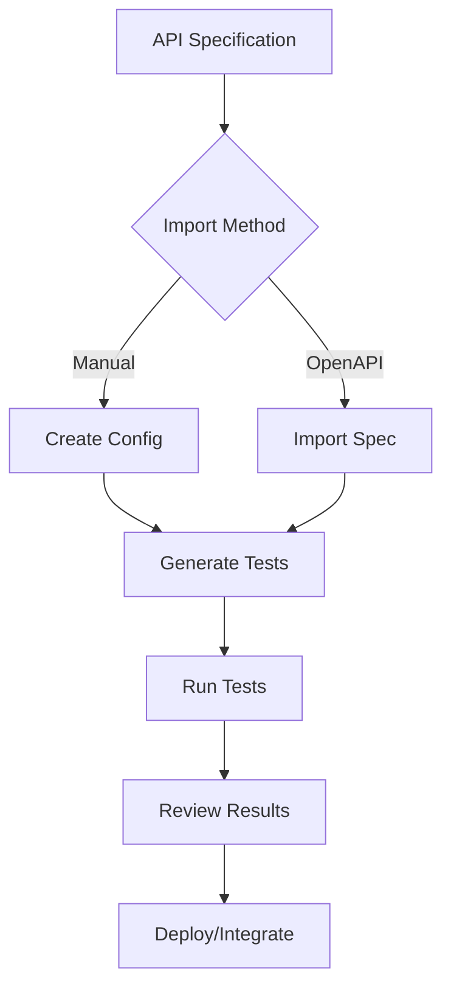

# Demo API Validation AI

An AI-powered, intelligent API test generation and validation system using TypeScript, Vitest, and automated test generation with GPT-4 enhancement. This framework can automatically generate comprehensive test suites for any REST API based on configuration, OpenAPI specifications, or natural language prompts.

## 🚀 Quick Start

```bash
# Install dependencies
pnpm install

# Generate tests for all configured APIs
pnpm run generate-tests all

# Generate tests for a specific API
pnpm run generate-tests geocoding

# Run all tests
pnpm test

# See a complete demo
pnpm exec ts-node scripts/demo.ts
```

## ✨ Features

- **🔄 Auto-Generate Tests**: Zero manual test writing required
- **📝 Multiple Input Sources**: Manual config, OpenAPI/Swagger specs, or API definitions
- **🧪 Comprehensive Coverage**: Happy path, validation, authentication, edge cases
- **🔐 Environment Management**: Secure API key handling with dotenv
- **⚡ Modern Stack**: TypeScript, Vitest, native fetch
- **🎯 Type Safety**: Fully typed endpoint definitions and test generation
- **🔧 Extensible**: Easy to add new API types and test scenarios

## 📖 Complete Documentation

See [FRAMEWORK_GUIDE.md](./FRAMEWORK_GUIDE.md) for:
- Detailed architecture explanation
- Step-by-step usage guide
- OpenAPI import instructions
- Advanced configuration options
- Extension and customization guide

## 🎯 How It Works

1. **Define your API** using the rich `Endpoint` interface or import from OpenAPI
2. **Generate tests** automatically with `TestGenAgent`
3. **Run comprehensive test suites** with Vitest
4. **Get detailed results** with validation, authentication, and edge case testing

```typescript
// Define any API
const myAPI: Endpoint = {
  name: 'My API',
  method: 'GET',
  url: 'https://api.example.com/data',
  parameters: [/* ... */],
  authentication: {/* ... */}
}

// Generate tests automatically
const agent = new TestGenAgent(myAPI)
const testCode = await agent.generate()
```

## 🔧 Environment Setup

Create `src/tests/.env`:
```bash
GOOGLE_API_KEY=your_google_api_key
OPENAI_API_KEY=your_openai_api_key
# Add any API keys your tests need
```

## 📊 Example APIs Included

- **Google Maps Geocoding API**: Address geocoding with validation
- **REST Countries API**: Country information lookup
- **JSONPlaceholder API**: Sample posts and users
- **OpenAPI Examples**: Petstore API via Swagger import

Built with ❤️ for effortless API testing.
- **OpenAPI/Swagger import** to automatically generate tests from existing API documentation
- **CLI tools** for batch test generation and API management

## 🏗️ Framework Architecture

```
src/
├── types.ts              # Core type definitions (Endpoint, Parameter, TestScenario)
├── configs/
│   └── apiConfigs.ts     # Pre-configured API endpoints
├── agents/
│   └── TestGenAgent.ts   # AI-powered test code generator
├── generators/
│   ├── generateTestCases.ts  # Core test case generation logic
│   └── generateTests.ts      # CLI script for batch generation
├── utils/
│   └── openAPIImporter.ts    # OpenAPI/Swagger spec importer
└── tests/
    └── *.test.ts         # Generated test files
```

## 🔧 How It Works

### 1. API Definition

The framework uses rich endpoint definitions that include:

```typescript
interface Endpoint {
  name: string                    // Human-readable name
  method: 'GET' | 'POST' | ...   // HTTP method
  url: string                     // API endpoint URL
  parameters: Parameter[]         // Request parameters
  authentication?: {...}          // Auth requirements
  responses: ExpectedResponse[]   // Expected response formats
  testScenarios?: TestScenario[]  // Custom test scenarios
}
```

### 2. Test Generation Process

1. **Parse API Configuration**: Load endpoint definitions from configs or OpenAPI specs
2. **Generate Test Scenarios**: Automatically create test cases for:
   - Happy path with valid data
   - Required parameter validation
   - Authentication testing
   - Parameter validation (types, enums, ranges)
   - Custom scenarios
3. **Generate Test Code**: Convert scenarios into Vitest test suites
4. **Write Test Files**: Save generated tests to the `tests/` directory

### 3. Test Execution

Tests use Node.js native `fetch` API to avoid Vitest serialization issues and include:
- Environment variable loading for API keys
- Proper HTTP status code assertions
- Response content type validation
- Schema validation (basic)

## 🚀 Quick Start

### 1. Setup Environment

Create a `.env` file in the project root:

```bash
# Google Maps API
GOOGLE_MAPS_API_KEY=your_api_key_here

# Add other API keys as needed
PETSTORE_API_KEY=your_petstore_key
```

### 2. Generate Tests for Pre-configured APIs

```bash
# Generate tests for a specific API
npm run generate-tests geocoding

# Generate tests for all configured APIs
npm run generate-tests all

# Available APIs: geocoding, countries, posts
```

### 3. Import from OpenAPI/Swagger

```typescript
import { OpenAPIImporter } from './src/utils/openAPIImporter'

// From local file
const endpoints = OpenAPIImporter.fromFile('./path/to/openapi.yaml')

// From URL
const endpoints = await OpenAPIImporter.fromURL('https://api.example.com/openapi.json')
```

### 4. Run Tests

```bash
# Run all tests
npm test

# Run specific test file
npx vitest run src/tests/geocoding.test.ts
```

## 📝 Adding New APIs

### Method 1: Manual Configuration

Add a new API configuration in `src/configs/apiConfigs.ts`:

```typescript
export const myAPI: Endpoint = {
  name: 'My Custom API',
  method: 'GET',
  url: 'https://api.example.com/endpoint',
  parameters: [
    {
      name: 'apiKey',
      type: 'string',
      required: true,
      description: 'API authentication key'
    },
    {
      name: 'query',
      type: 'string',
      required: true,
      description: 'Search query',
      validation: {
        min: 1,
        max: 100
      }
    }
  ],
  authentication: {
    type: 'api_key',
    location: 'query',
    name: 'apiKey'
  },
  responses: [
    { status: 200, contentType: 'application/json', schema: {} },
    { status: 400, contentType: 'application/json', schema: {} }
  ]
}
```

### Method 2: OpenAPI Import

```typescript
// Create a script to import and generate tests
import { OpenAPIImporter } from './src/utils/openAPIImporter'
import { TestGenAgent } from './src/agents/TestGenAgent'

async function importAndGenerate() {
  const endpoints = OpenAPIImporter.fromFile('./openapi-spec.yaml')
  
  for (const endpoint of endpoints) {
    const agent = new TestGenAgent(endpoint)
    const testCode = await agent.generate()
    
    // Save test file
    fs.writeFileSync(`./src/tests/${endpoint.name}.test.ts`, testCode)
  }
}
```

## 🧪 Generated Test Examples

The framework generates comprehensive test suites:

```typescript
describe('Google Maps Geocoding API', () => {
  // Happy path test
  it('should return success for valid GET request', async () => {
    const url = new URL('https://maps.googleapis.com/maps/api/geocode/json')
    url.searchParams.set('address', '1600 Amphitheatre Parkway, Mountain View, CA')
    url.searchParams.set('key', process.env.GOOGLE_MAPS_API_KEY!)
    
    const response = await fetch(url.toString())
    expect(response.status).toBe(200)
  })

  // Validation tests
  it('should return 400 when address parameter is missing', async () => {
    // Test missing required parameters
  })

  // Authentication tests
  it('should return 401 when API key is invalid', async () => {
    // Test authentication failure
  })
})
```

## 🔧 Configuration

### Vitest Configuration

The framework uses a custom Vitest config (`vitest.config.ts`) that:
- Loads environment variables from `.env`
- Uses single-threaded execution to avoid serialization issues
- Disables test isolation for better performance

### Environment Variables

- Create `.env` file in project root
- Add API keys and configuration
- Variables are automatically loaded in tests

## 🎯 Best Practices

1. **API Keys**: Always use environment variables for sensitive data
2. **Test Organization**: One test file per API endpoint
3. **Error Handling**: Test both success and failure scenarios
4. **Rate Limiting**: Be mindful of API rate limits during testing
5. **Schema Validation**: Add proper response schema validation

## 🚀 Advanced Features

### Custom Test Scenarios

Add custom test scenarios to your endpoint definitions:

```typescript
testScenarios: [
  {
    name: 'Test with special characters',
    description: 'Verify API handles special characters correctly',
    input: { address: 'Café München, Germany' },
    expected: { status: 200, contentType: 'application/json', schema: {} }
  }
]
```

### Rate Limiting Support

Configure rate limits for APIs:

```typescript
rateLimit: {
  requests: 10,
  per: 'second'
}
```

### Authentication Types

Support for multiple authentication methods:
- API Key (query, header, body)
- Bearer Token
- Basic Authentication

## 📊 Framework Benefits

1. **Rapid Test Development**: Generate comprehensive tests in seconds
2. **Consistency**: Standardized test structure across all APIs
3. **Maintainability**: Update API definitions to regenerate tests
4. **Documentation**: Tests serve as living API documentation
5. **Quality Assurance**: Comprehensive coverage including edge cases

## 🔄 Workflow



This framework makes API testing effortless and ensures comprehensive coverage for any REST API!
